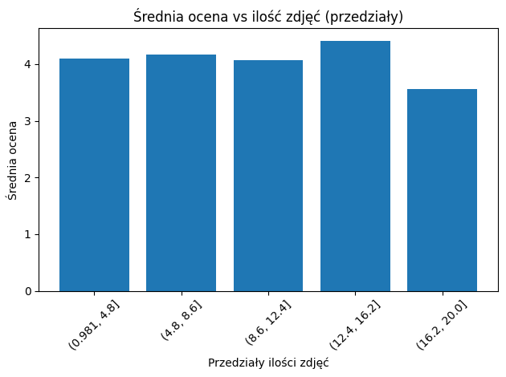
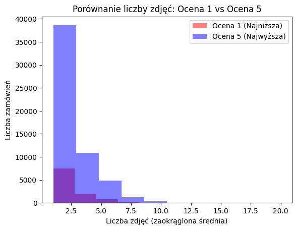

# Product Review Analysis

## Project Overview

This project analyzes e-commerce customer reviews to investigate whether product presentation factors, such as the number of images and description length, influence customer satisfaction.

## Business Question

Do products with more images and longer descriptions receive better customer ratings?

## Dataset

Dataset: Brazilian E-Commerce Public Dataset by Olist

The dataset contains information about orders, products, customers, reviews and sellers from a Brazilian e-commerce platform.

## Analysis Process

The project includes:

- data loading and exploration,
- data cleaning,
- feature engineering,
- exploratory data analysis,
- correlation analysis,
- visualization of results,
- business insights.

## Tools & Technologies

- Python
- pandas
- numpy
- matplotlib
- seaborn
- Jupyter Notebook

## Project Structure

## Visualizations

### Rating Distribution

### Images vs Customer Rating

### Description Length vs Customer Rating

### Best Rating vs Worst Rating by Photos

### Best Rating vs Worst Rating by Desciption Length

### Product Availability vs Sales Volume by Number of Images

This visualization compares the number of available products with the total number of purchases depending on the amount of product images

