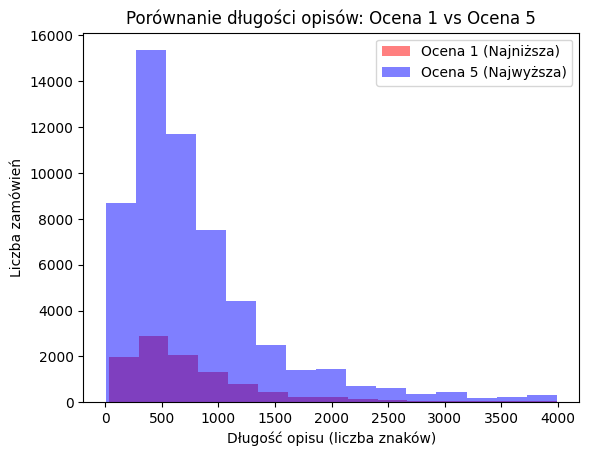
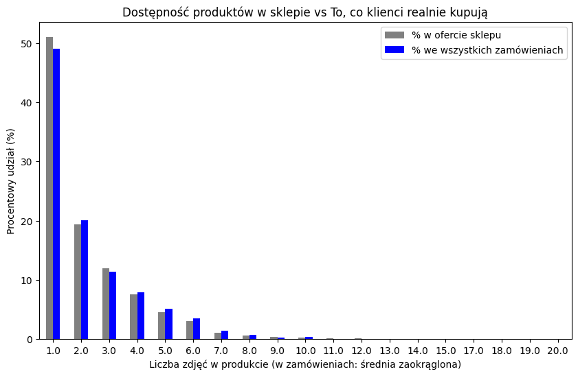

# Product Review Analysis

## Project Overview

This project analyzes e-commerce customer reviews to investigate whether product presentation factors, such as the number of images and description length, influence customer satisfaction.

## Business Question

Do products with more images and longer descriptions receive better customer ratings?

## Dataset

Dataset: Brazilian E-Commerce Public Dataset by Olist

The dataset contains information about orders, products, customers, reviews and sellers from a Brazilian e-commerce platform.

## Analysis Process

The project includes:

- data loading and exploration,
- data cleaning,
- exploratory data analysis,
- correlation analysis,
- visualization of results,
- business insights.

## Tools & Technologies

- Python
- pandas
- numpy
- matplotlib
- Jupyter Notebook

## Project Structure

## Visualizations

### Images vs Customer Rating

### Description Length vs Customer Rating

### Best Rating vs Worst Rating by Photos

### Best Rating vs Worst Rating by Description Length

### Product Availability vs Sales Volume by Number of Images

This visualization compares the number of available products with the total number of purchases depending on the amount of product images

## Key Findings

- Product description length does not show a significant relationship with customer ratings. Longer descriptions do not consistently lead to higher customer satisfaction.

- The number of product images has a more noticeable impact on customer ratings. Products with approximately 12–16 images achieved the highest average ratings, while a very large number of images showed a slight decrease.

- The analysis showed no strong linear correlation between image quantity and description length. However, products with extensive image galleries often had shorter descriptions, suggesting that visual presentation may partially replace the need for long text descriptions.

- Products with more than one image generated a higher share of purchases compared to their share in the available product assortment. Products with only one image were overrepresented in the catalog but slightly underrepresented in actual sales.

- Customer satisfaction depends on multiple factors. Product presentation alone does not fully explain review scores, suggesting that future analysis should include factors such as delivery time and shipping delays.

## Future Improvements

The analysis could be extended by including additional factors that may influence customer satisfaction and purchasing decisions:

- Analyze the impact of delivery time and shipping delays on customer ratings.
- Include seller-related factors such as seller reputation, number of previous orders, and customer service quality.
- Compare product performance across different categories to identify category-specific patterns.
- Apply statistical tests to verify whether observed differences between product groups are statistically significant.
- Build predictive models to estimate customer ratings based on product characteristics and order-related factors.
